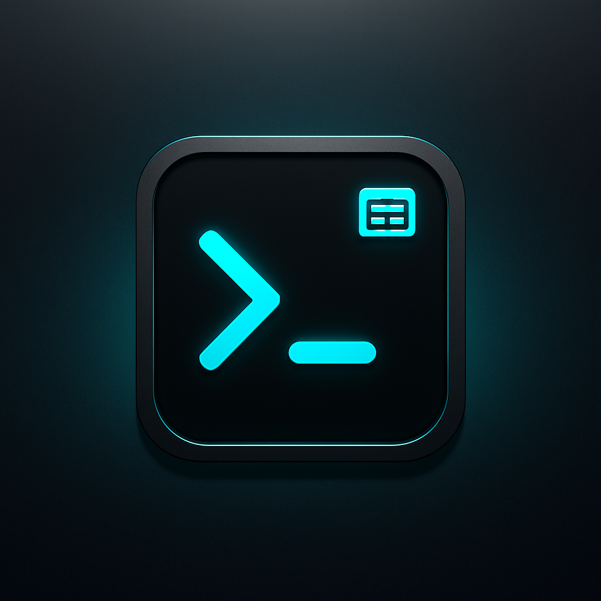

<!-- Improved compatibility of back to top link: See: https://github.com/galfrevn/scriptlane/pull/73 -->

<a id="readme-top"></a>

<!--
*** Thanks for checking out the Best-README-Template. If you have a suggestion
*** that would make this better, please fork the repo and create a pull request
*** or simply open an issue with the tag "enhancement".
*** Don't forget to give the project a star!
*** Thanks again! Now go create something AMAZING! :D
-->

<!-- PROJECT SHIELDS -->
<!--
*** I'm using markdown "reference style" links for readability.
*** Reference links are enclosed in brackets [ ] instead of parentheses ( ).
*** See the bottom of this document for the declaration of the reference variables
*** for contributors-url, forks-url, etc. This is an optional, concise syntax you may use.
*** https://www.markdownguide.org/basic-syntax/#reference-style-links
-->

[![Contributors][contributors-shield]][contributors-url]
[![Forks][forks-shield]][forks-url]
[![Stargazers][stars-shield]][stars-url]
[![Issues][issues-shield]][issues-url]
[![Unlicense License][license-shield]][license-url]
[![LinkedIn][linkedin-shield]][linkedin-url]

<!-- PROJECT LOGO -->
<br />
<div align="center">
  <a href="https://github.com/galfrevn/scriptlane">
    
  </a>

  <h3 align="center">scriptlane</h3>

  <p align="center">
    A developer-centric script runner & task orchestrator for modern monorepos.
    <br />
    <a href="https://github.com/galfrevn/scriptlane"><strong>Explore the docs »</strong></a>
    <br />
    <br />
    <a href="https://github.com/galfrevn/scriptlane">View Demo</a>
    &middot;
    <a href="https://github.com/galfrevn/scriptlane/issues/new?labels=bug&template=bug-report---.md">Report Bug</a>
    &middot;
    <a href="https://github.com/galfrevn/scriptlane/issues/new?labels=enhancement&template=feature-request---.md">Request Feature</a>
  </p>
</div>

<!-- TABLE OF CONTENTS -->
<details>
  <summary>Table of Contents</summary>
  <ol>
    <li>
      <a href="#about-the-project">About The Project</a>
      <ul>
        <li><a href="#built-with">Built With</a></li>
      </ul>
    </li>
    <li>
      <a href="#getting-started">Getting Started</a>
      <ul>
        <li><a href="#prerequisites">Prerequisites</a></li>
        <li><a href="#installation">Installation</a></li>
      </ul>
    </li>
    <li><a href="#usage">Usage</a></li>
    <li><a href="#roadmap">Roadmap</a></li>
    <li><a href="#contributing">Contributing</a></li>
    <li><a href="#license">License</a></li>
    <li><a href="#contact">Contact</a></li>
    <li><a href="#acknowledgments">Acknowledgments</a></li>
  </ol>
</details>

<!-- ABOUT THE PROJECT -->

## About The Project

[![scriptlane demo][product-screenshot]](https://github.com/galfrevn/scriptlane)

**scriptlane** is a next-generation CLI tool for developers and teams who want full control and a beautiful experience when running and organizing scripts across projects.

Whether you need a better workflow than `npm run`, want to orchestrate multiple scripts in parallel, or prefer a robust TUI for scripts in your monorepo—**scriptlane** has you covered.

### Features

- 🖥️ **Modern TUI**: Minimal, beautiful interactive interface for discovering and running scripts.
- 🏃 **Concurrent Tasks**: Select and run multiple commands in parallel with real-time logs.
- 🏷️ **Script Metadata**: Organize scripts with groups, descriptions, and aliases.
- 🛠️ **Custom Scripts**: Use a typed `scripts.config.ts` for full flexibility (no more JSON lock-in).
- ⚡ **CI/CD Ready**: Run any script directly in non-interactive mode for pipelines: `scriptlane -s "build"`
- 📝 **Copy-paste Logs**: Easily select and copy output with your mouse.
- 💻 **Zero lock-in**: Runs your current `package.json` scripts out of the box, supports merging with custom config.
- 🔒 **TypeScript-first**: Built with TypeScript for safety and extensibility.

<p align="right">(<a href="#readme-top">back to top</a>)</p>

### Built With

- [TypeScript](https://www.typescriptlang.org/)
- [blessed](https://github.com/chjj/blessed)
- [chalk](https://github.com/chalk/chalk)
- [tsup](https://tsup.egoist.dev/)

<p align="right">(<a href="#readme-top">back to top</a>)</p>

<!-- GETTING STARTED -->

## Getting Started

### Prerequisites

- [Node.js](https://nodejs.org/) (v18+ recommended)
- [npm](https://www.npmjs.com/)

### Installation

Global installation

```sh
npm install -g scriptlane
```

Global instalation

```sh
npm install --save-dev scriptlane
```

or use with npx (no install)

```sh
npx scriptlane
```

<p align="right">(<a href="#readme-top">back to top</a>)</p>

<!-- USAGE EXAMPLES -->

### Project setup

1. Add a scripts.config.ts to your project root:

```typescript
import type { ScriptsConfiguration } from 'scriptlane';

const scripts: ScriptsConfiguration = {
  Build: { cmd: 'npm run build', group: 'Frontend', description: 'Build frontend' },
  Test: { cmd: 'npm run test', group: 'CI', description: 'Run tests' },
};

export default scripts;
```

2. Run scriptlane in your project directory:

```sh
npx scriptlane
```

<p align="right">(<a href="#readme-top">back to top</a>)</p> <!-- USAGE EXAMPLES -->

## Usage

### Run Interactively

```sh
npx scriptlane
```
- Use the arrow keys and space/enter to select and run scripts.

### Run a Script in CI/CD

```sh
npx scriptlane -s "Build" # Command name or alias
```

- Runs the script named "Build" and exits with its exit code.

#### Options

Flag	Description
-s, --script	Run a script directly by name
-c, --config	Path to custom scripts config file

For more examples, see the documentation

<p align="right">(<a href="#readme-top">back to top</a>)</p> <!-- ROADMAP -->

<!-- ROADMAP -->

## Roadmap

- [x] TUI for multi-select and parallel scripts
- [x] Non-interactive CI/CD mode
- [ ] Cross-platform shell compatibility
- [ ] Plugin system for script extensions
- [ ] Custom keybindings and themes

See the [open issues](https://github.com/galfrevn/scriptlane/issues) for a full list of proposed features (and known issues).

<p align="right">(<a href="#readme-top">back to top</a>)</p>

<!-- CONTRIBUTING -->

## Contributing

Contributions are what make the open source community such an amazing place to learn, inspire, and create. Any contributions you make are **greatly appreciated**.

If you have a suggestion that would make this better, please fork the repo and create a pull request. You can also simply open an issue with the tag "enhancement".
Don't forget to give the project a star! Thanks again!

1. Fork the Project
2. Create your Feature Branch (`git checkout -b feature/AmazingFeature`)
3. Commit your Changes (`git commit -m 'Add some AmazingFeature'`)
4. Push to the Branch (`git push origin feature/AmazingFeature`)
5. Open a Pull Request

### Top contributors:

<a href="https://github.com/galfrevn/scriptlane/graphs/contributors">
  
</a>

<p align="right">(<a href="#readme-top">back to top</a>)</p>

<!-- LICENSE -->

## License

Distributed under the Unlicense License. See `LICENSE.txt` for more information.

<p align="right">(<a href="#readme-top">back to top</a>)</p>

<!-- CONTACT -->

## Contact

Your Name - [@your_twitter](https://twitter.com/your_username) - email@example.com

Project Link: [https://github.com/your_username/repo_name](https://github.com/your_username/repo_name)

<p align="right">(<a href="#readme-top">back to top</a>)</p>

<!-- ACKNOWLEDGMENTS -->

## Acknowledgments

Use this space to list resources you find helpful and would like to give credit to. I've included a few of my favorites to kick things off!

- [Choose an Open Source License](https://choosealicense.com)
- [GitHub Emoji Cheat Sheet](https://www.webpagefx.com/tools/emoji-cheat-sheet)
- [Malven's Flexbox Cheatsheet](https://flexbox.malven.co/)
- [Malven's Grid Cheatsheet](https://grid.malven.co/)
- [Img Shields](https://shields.io)
- [GitHub Pages](https://pages.github.com)
- [Font Awesome](https://fontawesome.com)
- [React Icons](https://react-icons.github.io/react-icons/search)

<p align="right">(<a href="#readme-top">back to top</a>)</p>

<!-- MARKDOWN LINKS & IMAGES -->
<!-- https://www.markdownguide.org/basic-syntax/#reference-style-links -->

[contributors-shield]: https://img.shields.io/github/contributors/galfrevn/scriptlane?style=for-the-badge
[contributors-url]: https://github.com/galfrevn/scriptlane/graphs/contributors
[forks-shield]: https://img.shields.io/github/forks/galfrevn/scriptlane?style=for-the-badge
[forks-url]: https://github.com/galfrevn/scriptlane/network/members
[stars-shield]: https://img.shields.io/github/stars/galfrevn/scriptlane?style=for-the-badge
[stars-url]: https://github.com/galfrevn/scriptlane/stargazers
[issues-shield]: https://img.shields.io/github/issues/galfrevn/scriptlane?style=for-the-badge
[issues-url]: https://github.com/galfrevn/scriptlane/issues
[license-shield]: https://img.shields.io/github/license/galfrevn/scriptlane?style=for-the-badge
[license-url]: https://github.com/galfrevn/scriptlane/blob/master/LICENSE.txt
[linkedin-shield]: https://img.shields.io/badge/-LinkedIn-black.svg?style=for-the-badge&logo=linkedin&colorB=555
[linkedin-url]: https://linkedin.com/in/galfrevn
[product-screenshot]: public/video.gif
[Next.js]: https://img.shields.io/badge/next.js-000000?style=for-the-badge&logo=nextdotjs&logoColor=white
[Next-url]: https://nextjs.org/
[React.js]: https://img.shields.io/badge/React-20232A?style=for-the-badge&logo=react&logoColor=61DAFB
[React-url]: https://reactjs.org/
[Vue.js]: https://img.shields.io/badge/Vue.js-35495E?style=for-the-badge&logo=vuedotjs&logoColor=4FC08D
[Vue-url]: https://vuejs.org/
[Angular.io]: https://img.shields.io/badge/Angular-DD0031?style=for-the-badge&logo=angular&logoColor=white
[Angular-url]: https://angular.io/
[Svelte.dev]: https://img.shields.io/badge/Svelte-4A4A55?style=for-the-badge&logo=svelte&logoColor=FF3E00
[Svelte-url]: https://svelte.dev/
[Laravel.com]: https://img.shields.io/badge/Laravel-FF2D20?style=for-the-badge&logo=laravel&logoColor=white
[Laravel-url]: https://laravel.com
[Bootstrap.com]: https://img.shields.io/badge/Bootstrap-563D7C?style=for-the-badge&logo=bootstrap&logoColor=white
[Bootstrap-url]: https://getbootstrap.com
[JQuery.com]: https://img.shields.io/badge/jQuery-0769AD?style=for-the-badge&logo=jquery&logoColor=white
[JQuery-url]: https://jquery.com
